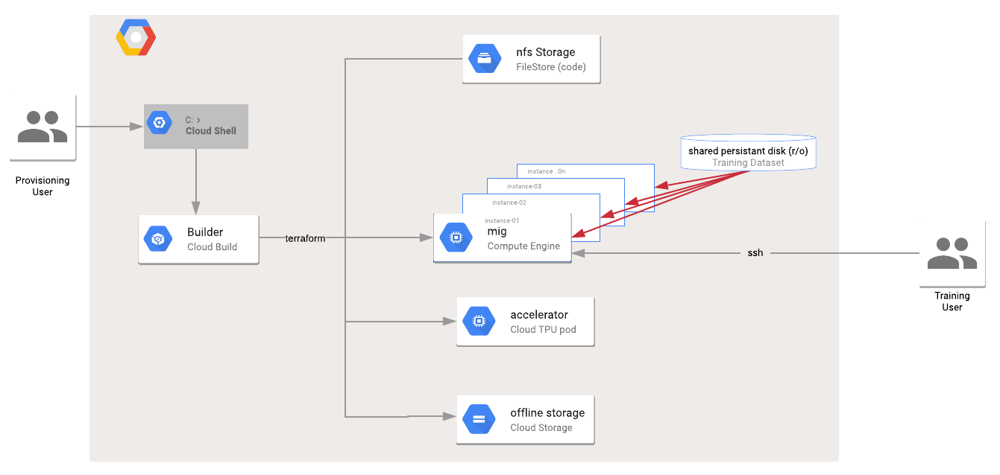

# Introduction 

This module builds off [PyTorch/XLA](https://github.com/pytorch/xla) and enables you to reliabliy instatiate a  [PyTorch Distributed Cloud TPU training enviroment](https://github.com/pytorch/xla#-how-to-run-on-tpu-pods-distributed-training) using Google Cloud Builder.

### What this module does
---

This module does the following 

1. Creates Cloud TPU pod 
2. Creates a NFS share to allow for the sharing of code between compute instances 
3. Creates a GCE Managed Instance Group (MIG) based on size of Cloud TPU pod
3. Allows user to specify a script that is used to customize the image in the instance group
4. Create a shared persistent disk (PD) that is used to host the dataset used for training
5. Allows the user to specificy a script to prepare the data before loading it to the shared persistant disk


# Build Commands

|Build Action |Cloud Build Command|
|:----------|:-------------|
| Initialize the enviroment  | ***gcloud builds submit --config=cloudbuild.yaml . --substitutions _BUILD_ACTION=initialize*** |
| Initialize the shared persistent disk  | ***gcloud builds submit --config=cloudbuild.yaml . --substitutions _BUILD_ACTION=initialize,_DISK=true*** |
| Create the enviroment | ***gcloud builds submit --config=cloudbuild.yaml . --substitutions _BUILD_ACTION=create*** |
| Destroy the enviroment | ***gcloud builds submit --config=cloudbuild.yaml . --substitutions _BUILD_ACTION=destroy*** |
| Update Cloud TPU | ***gcloud builds submit --config=cloudbuild.yaml . --substitutions _BUILD_ACTION=update,_TPU=true*** |
| Destroy Cloud TPU  | ***gcloud builds submit --config=cloudbuild.yaml . --substitutions _BUILD_ACTION=destroy,_TPU=true*** |
| Update the MIG | ***gcloud builds submit --config=cloudbuild.yaml . --substitutions _BUILD_ACTION=update,_MIG=true*** |
| Destroy the MIG | ***gcloud builds submit --config=cloudbuild.yaml . --substitutions _BUILD_ACTION=destroy,_MIG=true*** |
| Update both Cloud TPU and MIG | ***gcloud builds submit --config=cloudbuild.yaml . --substitutions _BUILD_ACTION=update,_TPU=true,_MIG=true*** |
| Updating shared persistent disk | ***gcloud builds submit --config=cloudbuild.yaml . --substitutions _BUILD_ACTION=update,_DISK=true,_MIG=true*** |


# Deployment Architecture Diagram


# Getting Started 

#### 1. Enable the GCP services
---

Clone the repo to your local enviroment. 
```
git clone https://github.com/mugithi/google-terraform-pytorch-tpu.git
cd google-terraform-pytorch-tpu
```
Enable GCP services using the following command 
```
gcloud services enable cloudbuild.googleapis.com \
                       compute.googleapis.com \
                       iam.googleapis.com \
                       tpu.googleapis.com \
                       file.googleapis.com 
```

#### 2. Enable IAM Permissions 
---

```
export PROJECT=$(gcloud info --format='value(config.project)')
export PROJECT_NUMBER=$(gcloud projects describe $PROJECT --format 'value(projectNumber)')
export CB_SA_EMAIL=$PROJECT_NUMBER@cloudbuild.gserviceaccount.com
gcloud projects add-iam-policy-binding $PROJECT --member=serviceAccount:$CB_SA_EMAIL --role='roles/iam.serviceAccountUser' 
gcloud projects add-iam-policy-binding $PROJECT --member=serviceAccount:$CB_SA_EMAIL  --role='roles/compute.admin' 
gcloud projects add-iam-policy-binding $PROJECT --member=serviceAccount:$CB_SA_EMAIL  --role='roles/iam.serviceAccountActor' 
gcloud projects add-iam-policy-binding $PROJECT --member=serviceAccount:$CB_SA_EMAIL  --role='roles/file.editor'  
gcloud projects add-iam-policy-binding $PROJECT --member=serviceAccount:$CB_SA_EMAIL  --role='roles/compute.securityAdmin'
gcloud projects add-iam-policy-binding $PROJECT --member=serviceAccount:$CB_SA_EMAIL  --role='roles/storage.admin'
gcloud projects add-iam-policy-binding $PROJECT --member=serviceAccount:$CB_SA_EMAIL  --role='roles/tpu.admin'
```


#### 3. Initialize the training environment 
---

Modify [values file](values.env) and set the *__training environment build id__* and *__project values__*. Initialize the enviroment using the command below. 

```
gcloud builds submit --config=cloudbuild.yaml . --substitutions _BUILD_ACTION=initialize
```

#### *3a. What happens when you initialize the enviroment* 

Initializing the traning enviroment creates GCS bucket to store both the configuration information and training information as follows

- tf_backend: TF state for filestore, cloud tpu, mig
- tf_backend/workspace: Workspace to store enviromental variables used by Cloud Buld in values.env
- tf_backend/worksplace/env_setup/scripts/: Scripts used to modify the instance group
- tf_backend/worksplace/env_setup/models/: Scripts that are loaded at start time to configure the instance group for training for a particular model. It comes preloaded with RoBERTa on Fairseq
- tf_backend: model specific training scripts
- dataset: bucket to store the training dataset

Each version of the environment is tracked using the variable `ENV_BUILD_NAME` unique to each environment. In order to create seperate enviroments, a specify a new `ENV_BUILD_NAME`.

It is recomended that you keep seperate versions of the cloned cloud build repo for each environment to easily allow to easily version your scripts and [variable](values.env) file. 

#### 4. Initialize the shared persistent disk 
---
Modify [values file](values.env) and set the *__shared persistent disk__* and *__gcs training dataset__* parameters. Initialize the shared persistent disk using the command below.

```
gcloud builds submit --config=cloudbuild.yaml . --substitutions _BUILD_ACTION=initialize,_DISK=true
```

#### *4a. What happens when you initialize the shared persistent disk* 

Initializing the shared persistent  disk, creates a shared persistent disk and seeds it with read only training using data from a GCS bucket specified by the `GCS_DATASET="gs://xxxxx/dataset/*` [variable](values.env) . This shared persistent disk is then mounted to all the GCE instances that are created in step 6

You also have the option of running a [data prepation script](env_setup/data_prep_script.sh) on the data before it is seeded to the shared persistent disk. 

#### 5. Create the enviroment 
---

Modify [values file](values.env) and set the *__cloud TPU__*, *__managed instance group__* and *__shared nfs__* parameters. Create the training enviroment using the command below. 

```
gcloud builds submit --config=cloudbuild.yaml . --substitutions _BUILD_ACTION=create
``` 

#### *5a. What happens when you build create the enviroment*

Running this command creates Filestore, Cloud TPU and Managed Instance Group using values in the [variable](values.env) file. 


#### 6. Destroy the enviroment 
---

```
gcloud builds submit --config=cloudbuild.yaml . --substitutions _BUILD_ACTION=destroy
``` 

Please note that destroying the environment using does not remove the GCS buckets. You can recreate the training enviroment by reruning the `_BUILD_ACTION=create` command.

# Updating the environment 

#### 1. Updating Cloud TPU pod 
---

```
gcloud builds submit --config=cloudbuild.yaml . --substitutions _BUILD_ACTION=update,_TPU=true
``` 

#### *1a. What happens when you update the Cloud TPU*

When this comamnd is run, a new Cloud TPU is created created or existing one is updated.

The update command can be used to upgrade from a v3-8 to a v3-128 by changing the `TPU_ACCELERATOR_TYPE="v3-32"` [variable](values.env) or Cloud TPU PyTorch version from torch-1.5 to torch nightly by changing cloud   `TPU_PYTORCH_VERSION="pytorch-1.5"`  [variable](values.env). 

The update command can also be used to recreate the Cloud TPU after destroying it using the `gcloud builds submit --config=cloudbuild.yaml . --substitutions _BUILD_ACTION=destroy,_TPU=true` command.

#### *1b. Modifying the Cloud TPU runtime*

TODO: If you specify a specific GCE torch-nightly version using the `GCE_IMAGE_VERSION="20200427"` [variable](values.env), cloud build will configure the Cloud TPU runtime to match the MIG GCE image version. If no value is called out in the [variable](values.env) `GCE_IMAGE_VERSION=""`, the latest nightly version is used.

Please note that updating the Cloud TPU pod does not modify the MIG. In order to change both the Cloud TPU and MIG, they both need to be explicity included in the cloud build substitation as follows `_BUILD_ACTION=update,_TPU=true,_MIG=true`

#### 2. Updating the Shared Persistent Disk 
---

```
gcloud builds submit --config=cloudbuild.yaml . --substitutions _BUILD_ACTION=update,_DISK=true,_MIG=true
``` 

#### *2a. What happens when you update the Shared persistent Disk*

When you run this command, 
- The existing shared persistent disk is destroyed and a new one is created. 
- This disk is mounted to a temporary GCE instance that runs any data preparation as specified in the [data preparation script](env_setup/scripts/data_prep_script.sh). 
- Formats new disk in ext4 and mounts it in path specified in the mount point `$MOUNT_POINT/shared_pd` as specified in the [variable](values.env) file
- Mounts the new shared persistent to the managed instance group as read only volume. 

The update command can be used to reload new training data into the shared persistent disk. 

#### *2c. Troubleshooting Shared persistent Disk*

Please note that updates to the shared persistent disk will only take place if you change its changing the `SHARED_PD_DISK_SIZE="XXXX"` [variable](values.env). If you do not change the size of the persistent disk when running an update, you will see the error.

`Step #1 - "terraform-google-disk": Step #0 - "terraform-google-disk-seed": Error: Error creating instance: googleapi: Error 400: The disk resource 'projects/xxxx' is already being used by 'projects/xxxx', resourceInUseByAnotherResource`

#### 3. Updating the Managed Instance Group MIG
---

```
gcloud builds submit --config=cloudbuild.yaml . --substitutions _BUILD_ACTION=update,_MIG=true
```  

#### *3a. What happens when you update the MIG*
When this comamnd is run, a new MIG is created created or existing one is updated.

The update command can be used to change the number of VMs in the MIG by changing the `TPU_ACCELERATOR_TYPE="v3-32"` [variable](values.env) or size of the shared persistent disk that stores the training data by changing the   `SHARED_PD_SIZE='1024'` [variable](values.env)

#### *3b. Modifying the GCE Image version*

If you specify a specific GCE torch-nightly using the  [variable](values.env) `GCE_IMAGE_VERSION="20200427"` and set the pytorch version in the  [variable](values.env) `TPU_PYTORCH_VERSION="pytorch-1.5"`, cloudbuild will provision a MIG using the torch-nightly specified GCE_IMAGE version. In all other cases, cloud build will use the latest nightly versionn.

Please note that updating the Cloud TPU enviroment does not modify the MIG size. In order to change both the Cloud TPU and MIG, they both need to be explicity included in the cloud build substitation as follows `_BUILD_ACTION=update,_TPU=true,_MIG=true`


